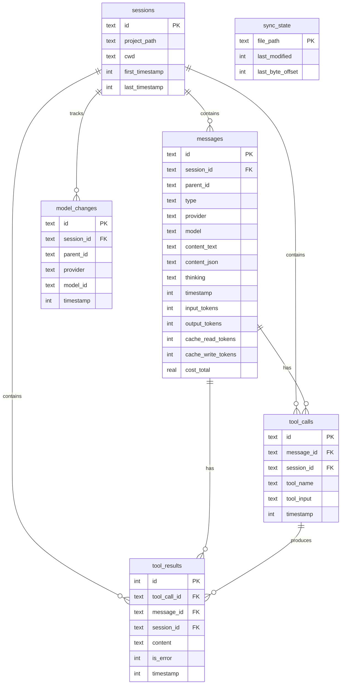

# pirecall

[](https://viteplus.dev)
[](https://vitest.dev)

Sync [pi.dev](https://pi.dev) agent sessions to SQLite for analytics.
Query your session history, token usage, tool calls, cost, and model
switches.

## Quick Start

Use pirecall inline in pi sessions. Tell the agent:

```
"run npx pirecall sync then show me my top 5 projects by token usage"

"use npx pirecall search to find sessions where we discussed database migrations"

"run npx pirecall stats and tell me how much I've spent this week"
```

The agent runs the command, gets structured output, and can answer
follow-up questions about your session history.

## How It Works

Pi stores sessions as JSONL files in `~/.pi/agent/sessions/`. pirecall
parses these into a SQLite database so you can query across all
sessions.

**Step 1.** Sync your sessions:

```bash
npx pirecall sync
```

**Step 2.** pirecall incrementally imports new content and reports
what it found:

```
Synced 24 sessions, 136 messages, 22 tool calls, 59 model changes
```

**Step 3.** Query the database using any pirecall command or raw SQL:

```bash
npx pirecall stats
npx pirecall search "database migration"
npx pirecall query "SELECT project_path, SUM(cost_total) FROM sessions s JOIN messages m ON m.session_id = s.id GROUP BY project_path ORDER BY 2 DESC LIMIT 5"
```

> **Important:** The agent doesn't know about pirecall unless you
> mention it. Just mention `{npx,pnpx,bunx} pirecall` and the agent
> will discover subcommands and flags from the CLI output.

## Commands

```bash
npx pirecall sync                  # Import sessions (incremental)
npx pirecall stats                 # Session/message/token/cost counts
npx pirecall sessions              # List recent sessions
npx pirecall search <term>         # Full-text search across messages
npx pirecall tools                 # Most-used tools
npx pirecall recall <term>         # LLM-optimised context retrieval
npx pirecall query "<sql>"         # Raw SQL against the database
npx pirecall schema                # Show database table structure
npx pirecall compact               # Prune old tool results
```

All commands support `--json` for programmatic output and
`-d, --db <path>` to use a custom database path (default:
`~/.pi/pirecall.db`).

## Database Schema



### Model/Provider Tracking

Tracks mid-session model switches from `~/.pi/agent/sessions/`. Pi
supports multiple providers (Anthropic, Mistral, etc.) and pirecall
records every switch with provider and model ID.

**Why track model changes?**

- See which models you actually use vs which you think you use
- Compare cost across providers for similar tasks
- Debug sessions where model switches caused behaviour changes

## Example Queries

```sql
-- Cost by session
SELECT s.project_path, s.id, SUM(m.cost_total) as cost
FROM sessions s
JOIN messages m ON m.session_id = s.id
GROUP BY s.id
ORDER BY cost DESC
LIMIT 10;

-- Token usage by day
SELECT DATE(timestamp/1000, 'unixepoch') as day,
  SUM(input_tokens + output_tokens) as tokens,
  ROUND(SUM(cost_total), 4) as cost
FROM messages
GROUP BY day
ORDER BY day DESC;

-- Model usage across providers
SELECT provider, model_id, COUNT(*) as switches
FROM model_changes
GROUP BY 1, 2
ORDER BY switches DESC;

-- Most used models
SELECT model, COUNT(*) as count
FROM messages
WHERE model IS NOT NULL
GROUP BY model
ORDER BY count DESC;

-- Tool usage breakdown
SELECT tool_name, COUNT(*) as count
FROM tool_calls
GROUP BY tool_name
ORDER BY count DESC;

-- Files read in a session
SELECT tc.tool_name, json_extract(tc.tool_input, '$.file_path') as file
FROM tool_calls tc
WHERE tc.tool_name = 'read' AND tc.session_id = 'your-session-id';

-- Cost by provider
SELECT m.provider, ROUND(SUM(m.cost_total), 4) as cost,
  SUM(m.input_tokens + m.output_tokens) as tokens
FROM messages m
WHERE m.provider IS NOT NULL
GROUP BY m.provider
ORDER BY cost DESC;
```

## Requirements

- Node.js 22+

## License

MIT
